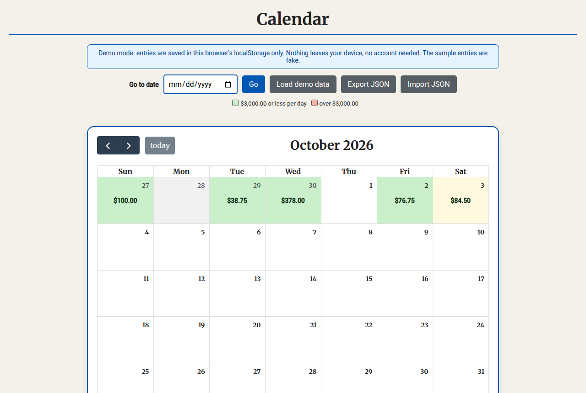
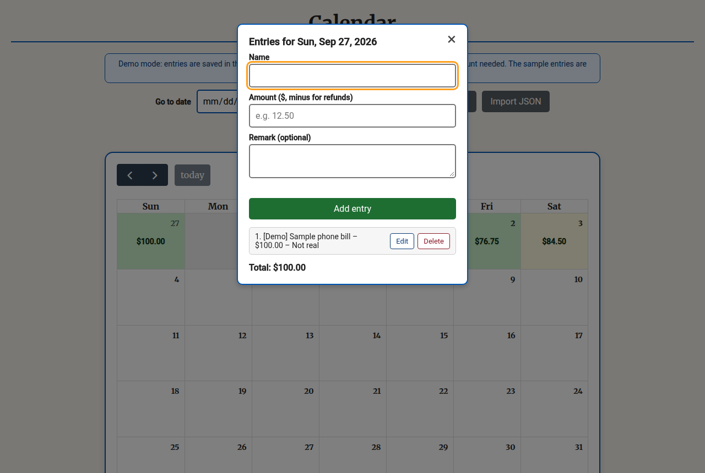
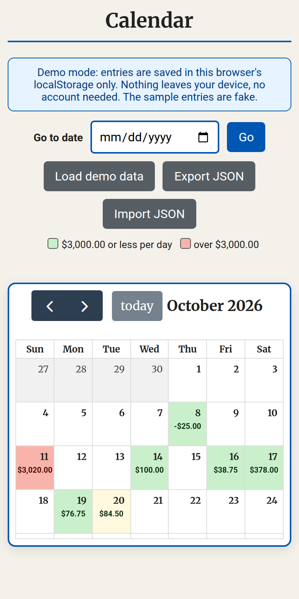

# Calendar

A single-file daily expense/entry tracker built with FullCalendar 6.

## What it is

Click any day to open a popup, add expense entries (name, amount, remark), and see
per-day totals colour-coded right in the month view — green for a normal day,
red when a day's total tops $3,000. Includes a Go-to-Date search.

## Feature tour

**Month view** — every day shows its total at a glance. Green means under the
$3,000 daily threshold, red flags a day that went over.

**Day popup** — click any date to add, edit, or delete entries. Amounts support
refunds (negative values), entries carry an optional remark and category, and the
day total updates live.

**Data controls** — export everything to JSON, import it back, or reload the
obviously-fake demo data any time. All entries live in your browser's
`localStorage` (versioned schema) — nothing leaves your device, no account or
backend needed. Storage failures (private mode, quota) are handled gracefully.

**Mobile** — the layout holds up on small screens, with the same color-coded
totals and the over-threshold day flagged in red.

## Demo

Live: https://vrdevil44.github.io/calendar/
